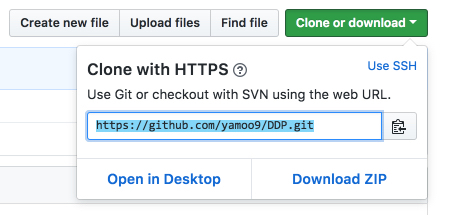
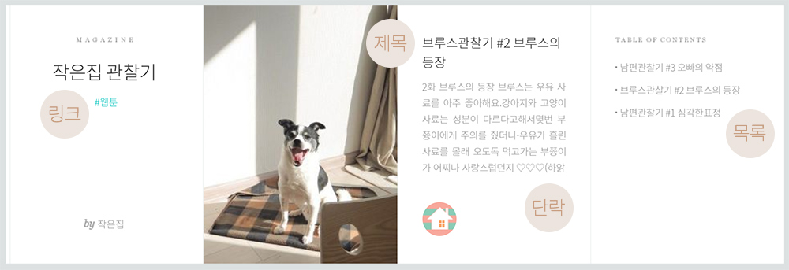
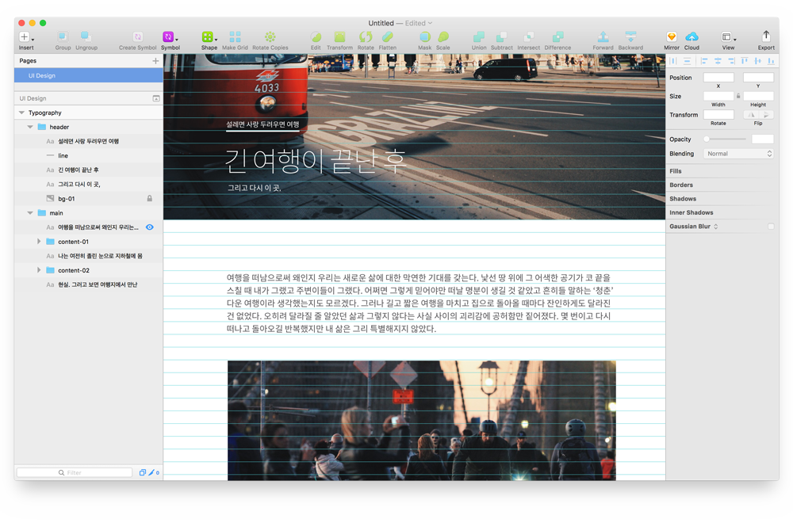

### 내비게이션

- [Home](../README.md)<br>
- D_01<br>
- [D_02](../D_02/README.md)<br>
- [D_03](../D_03/README.md)<br>
- [D_04](../D_04/README.md)<br>

---

<br>

###### DAY_01

## 모던 웹 디자인 프로세스

### 수업 진행을 위한 준비

#### 그래픽 소프트웨어

비주얼 디자인 파일을 열거나 편집하기 위한 도구입니다. 설치되어 있지 않다면 설치해주세요.

- [Photoshop](https://www.adobe.com/kr/products/photoshop.html)
- [Illustrator](http://www.adobe.com/kr/products/illustrator.html)
- [Adobe XD](http://www.adobe.com/kr/products/xd.html)

#### 에디터

수업에서 사용할 에디터를 특별히 규제하지는 않습니다. 자신에게 익숙한 제품을 선택합니다.

- [Visual Studio Code](https://code.visualstudio.com/)
- [Sublime Text](http://www.sublimetext.com/)
- [Atom](https://atom.io/)
- [Bracket](http://brackets.io/)
- [기타]()

#### 버전관리 도구

Git을 설치하고, GitHub 서비스 계정을 생성합니다.

- [Git for Windows](https://git-for-windows.github.io/)
- [GitHub](https://github.com)

#### 버전관리 GUI 도구

GUI가 익숙하신 분은 아래 도구를 선택적으로 설치하여 사용해보세요.

- [GitHub Desktop](https://desktop.github.com/)
- [SourceTree](https://www.sourcetreeapp.com/)

#### 브라우저 & 익스텐션

수업에서 사용할 브라우저와 익스텐션입니다. 설치해주세요.

- 브라우저 [Chrome](https://www.google.co.kr/chrome/browser/desktop/index.html)
- 익스텐션 [GitZip for github](https://chrome.google.com/webstore/detail/gitzip-for-github/ffabmkklhbepgcgfonabamgnfafbdlkn)
- 익스텐션 [Octotree](https://chrome.google.com/webstore/detail/octotree/bkhaagjahfmjljalopjnoealnfndnagc)

#### CLI 도구

Windows 기본 명령어 도구는 불편하죠. 보다 편리한 사용을 도와주는 도구를 설치해보세요. (택 1)

- [cmder](http://cmder.net/)([사용법](http://javaworld.co.kr/82))
- [conemu](http://conemu.github.io/)([사용법](http://programmingsummaries.tistory.com/352))

#### 서버 환경 도구

- [NodeJS](https://nodejs.org)
- [live-server](https://www.npmjs.com/package/live-server)


<br>

## GitHub 서비스

GitHub 계정 등록 및 저장소를 관리하는 방법을 공부해 봅니다.

1. Git 설치
1. GitHub 계정 생성 및 저장소 생성
1. Git Bash 및 CLI 도구 설정 및 명령어 활용
1. GitHub 프로젝트 웹 호스팅

<br>

### GitHub 원격저장소 클론

생성한 저장소 인터페이스 오른쪽에 있는 __Clone or download 버튼을 클릭__ 한 후, https 주소를 클립보드에 저장합니다.



명령어 도구를 열어 원격저장소를 복사할 위치로 이동합니다.

```sh
# 데스크톱으로 이동할 경우
$ cd ~/Deskop

# 도큐멘트로 이동할 경우
$ cd ~/Document
```


`git clone` 명령을 사용하면 원격저장소의 데이터를 로컬 컴퓨터로 다운로드 받습니다.

```sh
$ git clone https://github.com/<계정이름>/<저장소이름>.git
```

<br>

### GitHub Page 브랜치(Branch)를 활용한 웹 호스팅

저장소(Repository) 올판 브랜치(orphan branch)<sup id="go-back-orphan-branch"><a href="#orphan-branch">1</a></sup>를 만든 후,
정적 에셋(static assets)을 추가한 후 저장소에 업로드하면 웹 호스팅을 할 수 있습니다.

먼저 명령어 환경에서 `gh-pages` 브랜치를 생성합니다.

```sh
$ git checkout --orphan gh-pages
```

이어서 `git` 제거 명령을 사용하여 Git과 관련된 파일을 모두 제거합니다.

```sh
$ git rm -rf .
```

로컬 저장소에 `index.html` 파일을 추가합니다.

```html
<!DOCTYPE html>
<html lang="ko-KR">
<head>
  <meta charset="UTF-8">
  <meta name="viewport" content="width=device-width, initial-scale=1.0">
  <meta http-equiv="X-UA-Compatible" content="ie=edge">
  <title>GitHub 웹 호스팅</title>
</head>
<body>

  <h1>gh-pages 브랜치를 사용한 웹 호스팅 테스트</h1>

</body>
</html>
```

`index.html` 파일을 관리하도록 추가(add)한 다음 커밋(commit)을 수행합니다.

```sh
$ git add index.html
$ git commit -m "index 페이지 추가"
```

이어서 `gh-pages` 브랜치를 원격저장소로 푸시(push) 합니다.

```sh
$ git push origin gh-pages
```

정상적으로 푸시가 되었다면 아래 웹 호스팅 주소를 참고하여 접속해보세요.

```xml
https://<계정이름>.github.io/<저장소이름>
```

`gh-pages` 브랜치에서 마스터(master) 브랜치로 복귀하고자 한다면 `checkout` 명령을 사용합니다.

```sh
$ git checkout master
```

다시 `gh-pages` 브랜치로 변경하는 방법도 동일합니다. 웹호스팅에 파일을 추가할 때는 `gh-pages` 브랜치로 변경한 후, 커밋/푸시 합니다.

```sh
# 브랜치 목록 확인
$ git branch
#   gh-pages
# * master

# 브랜치 변경
$ git checkout gh-pages
```

<br>

### 로컬 테스트 서버 환경

[NodeJS 다운로드](https://nodejs.org/en/download/) 페이지에서 인스톨러(installer)를 다운로드 받아 설치합니다. (`8.x.x` LTS 버전 다운로드)

설치가 완료되면 NodeJS 버전을 명령어 도구 화면에 출력해봅시다.

```sh
$ node --version # v8.9.1
```

정상적으로 버전이 출력된다면 로컬저장소 루트 위치에서 `npm init` 명령을 사용해 `package.json` 파일을 생성합니다.

```sh
$ npm init -y
```

이어서 `npm install` 명령을 사용해 [live-server](https://www.npmjs.com/package/live-server) 개발 모듈을 설치합니다.

```sh
$ npm install --save-dev live-server
```

로컬저장소 루트 위치에 생성된 `package.json` 파일을 열어 NPM 스크립트 구문(`"scripts"` 부분)을 추가합니다.

```sh
{
  ...
  "scripts": {
    "serve" : "live-server --port=8888"
  },
  ...
}
```

<details>
  <summary>live-server 옵션</summary>

  <br>

  - `-v` | `--version` 버전 보기
  - `-h` | `--help` 도움말 보기
  - `--port=PORT` 포트 설정
  - `--browser=BROWSER` 브라우저 설정
  - `-q`|`--quiet`
  - `--host=HOST`
  - `--open=PATH`
  - `--no-browser`
  - `--ignore=PATH`
  - `--ignorePattern=RGXP`
  - `--entry-file=PATH`
  - `--spa`
  - `--mount=ROUTE :PATH`
  - `--wait=MILLISECONDS`
  - `--htpasswd=PATH`
  - `--cors`
  - `--https=PATH`
  - `--proxy=PATH`
  - `PATH`

</details>

<br>

등록한 NPM 스크립트 `serve` 명령을 실행(`run`)해봅니다. 웹 브라우저에 로컬호스트 서버가 정상적으로 실행될 겁니다.

```sh
$ npm run serve
```

---

<br>

—

### [타이포그래피](./Typography.md)

일반적으로 타이포그래피 디자인은 사용자가 읽거나 듣는 콘텐츠를 설계(Design)하는 것을 말합니다.

- 본문/단락(Paragraph)
- 제목(Headings)
- 하이퍼링크(Hyperlink)
- 목록(Lists)

<br>



<br>
<br>

__실습 콘텐츠__

아래 실습 콘텐츠를 활용하여 타이그래피 디자인을 진행합니다.

[](https://brunch.co.kr/@12m17d/46)

실습용 텍스트 콘텐츠

---

설레면 사랑 두려우면 여행

긴 여행이 끝난 후

그리고 다시 이 곳,

─

여행을 떠남으로써 왜인지 우리는 새로운 삶에 대한 막연한 기대를 갖는다. 낯선 땅 위에 그 어색한 공기가 코 끝을 스칠 때 내가 그랬고 주변이들이 그랬다. 어쩌면 그렇게 믿어야만 떠날 명분이 생길 것 같았고 흔히들 말하는 ‘청춘’ 다운 여행이라 생각했는지도 모르겠다. 그러나 길고 짧은 여행을 마치고 집으로 돌아올 때마다 잔인하게도 달라진 건 없었다. 오히려 달라질 줄 알았던 삶과 그렇지 않다는 사실 사이의 괴리감에 공허함만 짙어졌다. 몇 번이고 다시 떠나고 돌아오길 반복했지만 내 삶은 그리 특별해지지 않았다.

> content-01.jpg [Copyright 2015. 동경(insta@id1992) all rights reserved. [미국/뉴욕]]

나는 여전히 졸린 눈으로 지하철에 몸을 실었고 피곤한 몸으로 퇴근을 했으며 덕분에 온전히 나에게 들일 수 있는 시간마저 확연히 줄어들었다. 여유라는 마음을 배워온 듯했으나 내가 살아가야 할 곳의 사람들은 여전히 바쁘게 움직였고 내가 그곳에서 느꼈던 감정들은 현실성 없이 겉도는 것쯤으로 정의 내려지는 듯했다

비슷한 시기에 한국으로 돌아온 친구 S는 말했다. "여행 중에 했던 인터뷰의 마지막 질문이 한국으로 돌아갈 때 가장 두려운 게 무엇이냐는 거였는데, 나는 그때 '지금 이 느낌을 잊고 사는 거요'라고 답했거든, 근데 내가 벌써 그러고 있더라". 후배 K 역시 비슷한 이유로 탄식했다.

대부분의 여행자들이 긴 여행을 마치고 돌아왔을 때 가장 두려워하는 것은 예상컨대 돌아올 자리가 없는 것도 아니고, 남들보다 뒤처지는 것도 아니고 그저 내가 보고 듣고 느꼈던 것들이 점차 사회가 만든 ‘현실’이라는 벽에 부딪쳐 사라지는 것일지도 모른다. 아, 어쩌면 여행 후에 달라진 것이 없다며 홀로 괴로워하는 것 역시 '현실'이 내뱉는 추긍에 지나온 시간들을 합리화할 수 없을지 모른다는 불안함에서 오는 두려움은 아니었을까.

> content-02.jpg [Copyright 2015. 동경(insta@id1992) all rights reserved. [미국/뉴욕]]

현실. 그러고 보면 여행지에서 만난 대부분의 사람들은 ‘현실’이라는 말을 쓰지 않았다. 그러나 그들은 어딘가에서 ‘현실’에서 벗어난 사람들로 인식되고 있는 듯했다. 먹고 싶은 거 먹고 쉬고 싶은 만큼 쉬는 것. 살아 숨 쉬는 내가 값을 주고 행하는 모든 것이 어찌 비현실이 될 수 있는지. 혹시 그 누군가 이 모든 걸 비현실로 정의 내렸기 때문에 현실과의 이해관계에서 숱한 장애물이 생겨나 결국 잊어가야만 살아가기 편하게끔 만들어 버린 건 아닐는지.

왜인지 나는 이제 그간 어땠느냐는 안부에 그저 지난 공백에 비례하는 무언가를 바라는 벽 앞에 무너지지 않으려 노력하고 있다는 대답 밖에는 할 말이 없을 것 같다.

---

__UI 디자인의 핵심__ ⇔ __타이포그래피 디자인__<i>!</i>

타이포그래피는 기능성을 가질 때 UI가 됩니다.


<br>
<br>


—

### [그리드 시스템](./GridSystem.md)

"정보에 질서를 부여하는 것"이 그리드 시스템을 사용하는 이유입니다.

그리드 시스템은 디자이너의 창의성을 저해하지 않습니다. 질서를 쉽고 강력하게 제작하도록 도와주는 디자인 도구입니다.

시스템(체계)을 토대로 기원 원칙 위에 다양한 응용을 반영하여 디자인(설계) 할 수 있습니다.


#### 그리드 시스템을 기반으로 기본에 충실하면서 다양한 응용을 보여주는 디자인 예시


<br>


<!-- — -->

<!-- ### [UI Kit](./GridSystem.md) -->

---

###### 각주

1. <p id="orphan-branch"><a href="#go-back-orphan-branch">기록(history)이 없는 브랜치(branch)를 말합니다.</a></p>