[← Back](./README.md)

<br>

## 타이포그래피

### 웹 디자인의 95%는 타이포그래피<i>!</i>

디지털 프로덕트 스튜디오 [iA Labs](https://ia.net/)의 설립자 올리버 하이슌슈타인([Oliver Reichenstein](https://twitter.com/reichenstein))은 "[Web Design is 95% Typography](https://ia.net/topics/the-web-is-all-about-typography-period/)" 글을 통해 웹 디자인의 95%는 타이포그래피로 구성되어 있다고 말했습니다.
사용자는 타이포그래피를 통해 정보를 읽고 이해합니다. 타이포그래피에 대한 중요성은 수업이 강조해도 부족함이 없습니다.


<br>

#### 디자인은 커뮤니케이션입니다.

웹/앱, 웨어러블 UI. 어떤 것을 디자인하더라도 결과는 그 의도와 목적을 분명하고 명확하게 전달해야 합니다.
그리고 커뮤니케이션에 있어 타이포그래피는 매우 중요한 역할을 하기 때문에 디자이너는 타이포그래피에 대한 탄탄한 이해가 필요합니다.

물론, UI를 디자인하는 것은 이북(ebook)이나 블로그 테마(theme)를 디자인하는 것과는 분명 다릅니다. 하지만 디자인의 중심이 글자가 된다는 원칙은 다르지 않습니다.
결국, UI 화면에서의 커뮤니케이션은 타이포그래피를 통해 이루어지고, 폰트가 언어의 UI가 되는 셈입니다.

타이포그래피를 최적화하는 것은 가독성, 접근성, 사용성 뿐만 아니라 전반적인 그래픽 밸런스를 조율하는 과정이 포함됩니다.
즉, 타이포그래피 최적화란? UI 최적화라고도 볼 수 있습니다.

<br>

### UI 디자인에 적합한 타이포그래피

타이포그래피의 거장, 로버트 브링허스트(Robert Bringhurst)는 그의 대표작 [The Elements of Typographic Style](http://font.co.kr/thet/thet_detail.asp?itemIdx=4013&itemType=34)에 다음과 같이 말했습니다.

타이포그래피는 콘텐츠를 존중하기 위해 존재합니다.

UI는 사용자가 직접 결정하고 선택할 수 있는 요소로 구성되어 있습니다.
타이포그래피는 사용자가 인식 가능한 선에서 콘텐츠를 명확히 제공하고, 사용자의 의사결정 과정을 도와주어야 합니다.
위대한 타이포그래피는 사용자를 콘텐츠로 이끄는 것이 목적이어야 하며, 폰트나 이미지 그 자체만 집중하게 해서는 안됩니다.

#### 1. 다양한 크기에 대응 가능한 폰트

대부분의 UI는 다양한 크기의 텍스트 요소(버튼 텍스트, 레이블 텍스트, 섹션 헤더 텍스트, 바디 텍스트 등)로 이루어져 있습니다.
즉 가독성 및 다양한 크기, 두께 등에 대응 가능한 폰트를 선택해야 합니다.

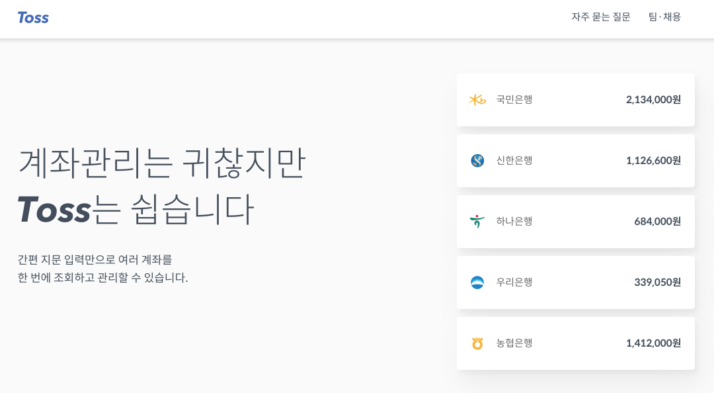

#### 2. 쉽게 구분될 수 있는 폰트 (영문의 경우)

비슷한 폰트의 경우 헷갈리기 쉽습니다. 예를 들어 대문자 `I`와 소문자 `l`은 상당히 비슷해 보입니다. 또, 소문자 `rn`은 소문자 `m` 처럼 보이기도 하죠.
폰트의 기본은 가독성인 만큼 형태 구분이 확실한 폰트를 사용해야 사용자에게 명확한 의미를 전달 할 수 있습니다.

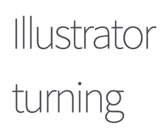

> [Spoqa Han Sans](https://spoqa.github.io/spoqa-han-sans/ko-KR/) 폰트의 경우, 대문자 `I` 소문자 `l` 구분이 모호합니다. `rn` 또한 자간에 따라 `m`으로 보일 수 있습니다.

#### 3. UI로서 타이포그래피를 고려

좋은 디자이너는 타이포그래피를 콘텐츠로 생각하지만, 위대한 디자이너는 타이포그래피를 UI로 생각합니다.

UI 디자인 시에 꼭 머리에 새겨둬야 하는 문장입니다. 타이포그래피가 기능적인 역할을 가질 때, UI가 되기 때문이죠.

모든 UI 디자인은 타이포그래피와 뗄레야 뗄 수 없는 관계입니다. 납득이 가질 않는다면 생각해보세요.<br>
"미세요(Push)" 라고 표기된 문이 미닫이 문이었을 때, 느껴질 사용자의 혼란을 떠올려보세요.


<br>
<br>

#### 4. 사용자의 진정한 목적

JTBD(Job to be done)란 용어는 사용자의 진정한 니즈(Needs)를 위한 디자인 관점을 말합니다.
디자이너는 사용자가 문제를 해결하는 과정을 어떻게 디자인(설계) 적으로 도와줄 수 있는지 계속 질문을 던져야 합니다.
질문을 통해 도출해낸 답이 곧, UI에 반영되어야 합니다. 물론 타이포그래피도 포함해서 말이죠.

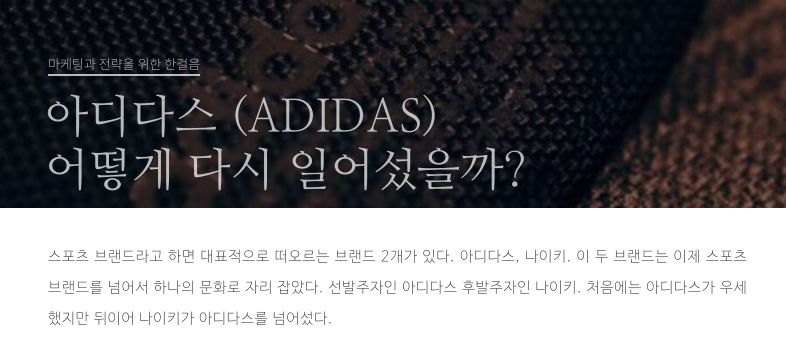

> [Brunch](https://brunch.co.kr) 서비스는 사용자의 진정한 목적과 그에 맞는 폰트를 잘 조합하였습니다.

<br>

Brunch의 UI는 대부분 타이포그래피 기반이고 읽는 것에 초점이 맞춰져 있어, 디자이너는 2가지 서로 다른 폰트를 선택했습니다.

사용자의 주목을 이끌어내는 헤더 텍스트는 명조 계열 인 나눔 명조(Nanum Myeongjo)를,
지속적으로 읽어야 하는 바디 텍스트는 고딕 계열 인 나눔 바른고딕(콘텐츠를 위한)을 사용해 사용자의 목적에 부합한 결과를 이끌어 냈습니다.
이는 사용자가 읽어야 할 컨텐츠와 그렇지 않은 것을 명확하게 구분 가능하게 합니다.

사용자의 기대에 부응하는 폰트 선택은 이처럼 굉장한 효과적입니다. 그동안 우리는 수천 권의 책, 잡지 그리고 신문들에서
명조 계열 폰트를 읽어오면서 장문의 콘텐츠를 소비하곤 했습니다. 하지만 오늘날은 웹의 출현 이후 두드러지게 고딕 계열 폰트를 바디 테스트에 사용합니다.

<br>
<br>

## 웹 타이포그래피 시스템 (Typography System)

디자인 원칙에 따른 타이포그래피를 설계(Design)함을 말한다.

### 모듈러 스케일(Modular Scale)

모듈러 스케일이란? 관계된 객체 간에 개별적으로 일정한 배율(Ratio)이 반영된 수의 나열이다.


#### 타입 스케일 배율(Type Scale Ratio)

- `1.067` — Minor Second
- `1.125` — Major Second
- `1.200` — Minor Third
- `1.250` — Major Third
- `1.333` — Perfect Fourth
- `1.414` — Augmented Fourth
- `1.500` — Perfect Fifth
- `1.600` — Minor Sixth
- `1.618` — Golden Ratio (황금 비율)
- `1.667` — Major Sixth
- `1.778` — Minor Seventh
- `1.875` — Major Seventh
- `2.000` — Octave
- `2.500` — Major Tenth

### 베이스라인(Baseline)

베이스라인이란? 행(Row) 사이 간격으로 글자 크기(Font Size)를 포함하는 높이를 말한다.


#### 버터컬 리듬(Vertical Rhythm)

버티컬 리듬이란? 각 요소(Elements) 간의 수직적인 공간 배열 관계를 말한다.


<br>

### 웹 타이포그래피 시스템이 반영된 디자인

왼쪽 vs 오른쪽 결과물 중, 디자인 관점에서 우수한 것은 무엇일까?


<br>
<br>

## CSS 타이포그래피 시스템 & 모듈러 스케일

**모듈러 스케일** & **베이스라인** & **버티컬 리듬**이 반영된 타이포그래피 시스템은 아름답다.


#### 타이포그래피 시스템(Typography System) 결과물


<br>

#### 행간을 설계하는 본문(Body Text) 디자인

글자 크기(`font-size`)는 짝수 값을 설정하고, 글줄 간격(행간, `line-height`)은 글자 크기에 상대적으로 적용한다.

```css
body {
  font-size: 14px;     /* 글자 크기는 12px, 14px, 16px, 18px, ... 짝수로 설정 */
  font-size: 0.875rem; /* IE 9+ 을 포함하는 최신 브라우저에서는 rem 단위가 적용 */
  line-height: 1.5;    /* 행간은 글자 크기에 상대적으로 설정 */

  /* [접근성, 인식의 용이성] 배경색 대비 전경색은 색 대비가 4.5:1 이상으로 설정 */
  background-color: #fcfefd;
  color: #23251b;
}
```

<br>

##### 자간 / 어간 / 행간 설정

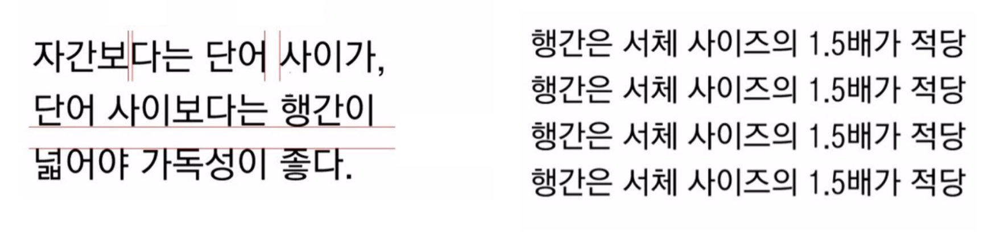

##### 글자 크기

글자 크기를 홀수로 지정할 경우 글자 사이 간격(자간, `letter-spacing`)에 변화가 발생한다.<br>

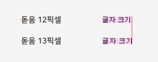<br>

돋움, 굴림 15픽셀은 14픽셀과, 17픽셀은 16픽셀과, 19픽셀은 18픽셀과 글자 자체의 크기는 같고 글자 간격만 다르다.<br>
단, 20픽셀 이상의 크기에서는 정상적으로 표현된다.

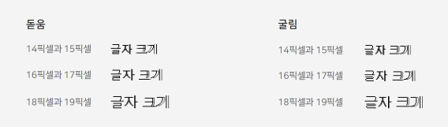<br>

이러한 이유로 돋움 13, 15, 17, 19픽셀과 굴림 15, 17, 19픽셀은 정상적으로 표현되지 않는다.<br>
나눔글꼴 등 다른 글꼴을 사용할 때도 돋움이 대체 글꼴로 사용되는 경우를 대비해 크기를<br>
13, 15, 17, 19픽셀로 설정하지 않는 것이 좋다.

##### 행간

일반적으로 행간은 글자 크기 2배보다 작은 값을 설정해야 하며 상대 값을 설정해야 한다.<br>
그리고 행간은 글자 크기를 뺀 나머지 공간을 상/하 방향으로 양분한다.

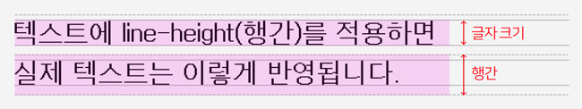<br>

행간에 따라 글을 읽기 쉽거나, 어려워질 수 있음에 주의해서 디자인 한다.

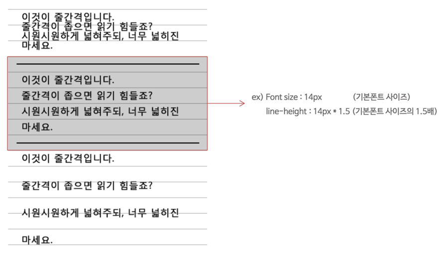<br>

<br>

#### 가독성을 고려한 자간 조정

##### 트래킹

글자 사이 간격을 설정해 모든 글자 사이 간격을 일정하게 조정(트래킹, Tracking)할 수 있다.

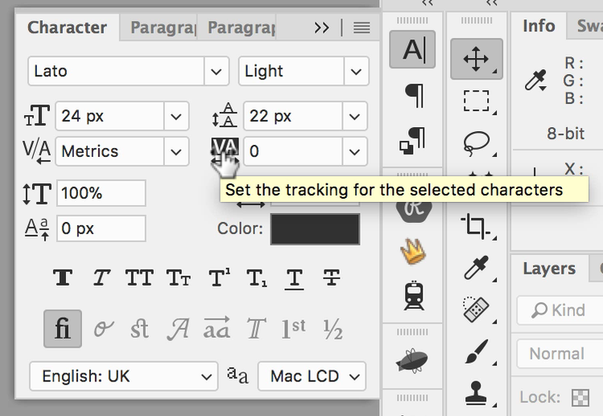<br>

Photoshop의 자간 설정은 1/1000em 으로 계산해서 적용해야 한다.

__Photoshop User Guide__

[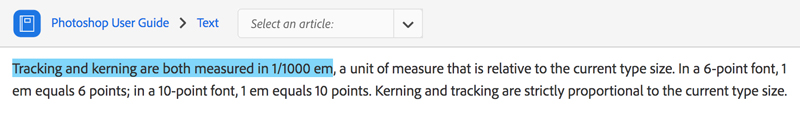<br>](https://helpx.adobe.com/photoshop/using/line-character-spacing.html)

Photoshop 자간을 -100으로 설정한 경우

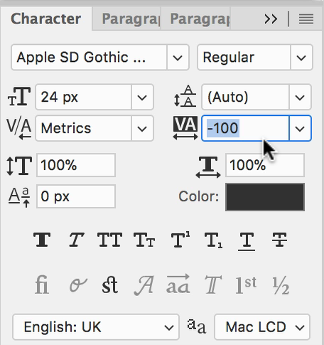<br>

CSS 코드로 옮겼을 때 em 단위 값으로 변경 적용하면 다음과 같다.

```css
.photoshop__letter-spacing {
  letter-spacing: -0.1em;  /* -100/1000em */
}
```

브라우저 렌더링 방식 차이 때문에 글꼴과 글자 크기에 따라 실제로 보이는 자간이 다를 수 있다.
정수가 아닌 값을 설정하는 경우 또한 브라우저마다 소수점 아래의 값을 다르게 처리하므로
값을 정수로 설정하는 것이 좋다.

예를 들어 포토샵에서 14px 기준으로 자간을 -69로 설정하면 CSS로 변환했을 때 -0.966px이 된다.
이 값은 정수가 아니기에 브라우저 렌더링 방식의 차이에 따라 다르게 보일 수 있다. 이를 올림하여 정수 -1px로 설정한다면 변화의 폭이 줄어든다.

```css
.photoshop__letter-spacing {
  font-size: 14px;
  font-size: 0.875rem;
  letter-spacing: -1px;  /* -69 ÷ 1000 × 14px ≒ -1px */
}
```

##### 커닝

특정 글자 사이의 간격만 조정하는 커닝(Kerning)은 웹 기술로 아직은 구현할 수 없다.

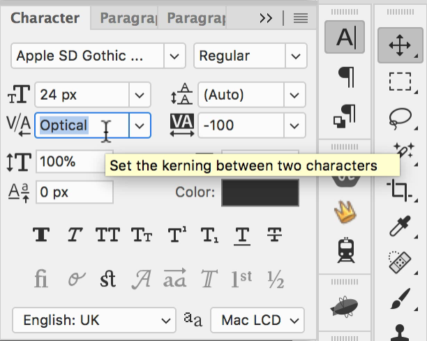<br>
> 전체 영역에 커닝하는 경우

<br>

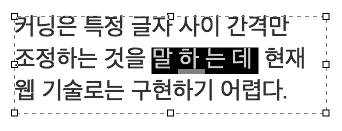<br>
> 선택한 영역에만 커닝하는 경우

<br>

그러한 이유로 디자인 과정에서 커닝을 설정할 경우, 실제 웹 디자인으로 구현된 결과는 다르게 되니 주의가 요구된다.<br>
만약 커닝이 필요한 경우 이미지 텍스트를 사용해야만 한다. (단, 성능 저하의 원인이 되니 꼭 필요한 경우만 사용하자)

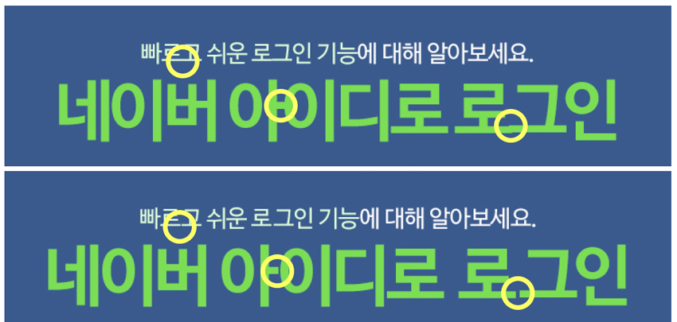<br>
> 커닝을 적용하지 않은 경우(위) VS 커닝을 적용한 경우(아래)<br>
> 커닝을 적용한 경우가 가독성이 좋다.

<br>

#### 모듈러 스케일을 반영한 단락, 제목 글자 크기 설정

> 폰트크기(font-size): 이전 폰트크기(previous-font-size) × 타입배율(type-scale)

```css
h5 {
  font-size: 1.125rem; /* (1 × 1.125) */
}

h6 {
  font-size: 1rem; /* 1rem = 16px */
}
```

#### 재사용 가능한 클래스 속성 설정

```css
h1,
.exa {
  font-size: 1.8020rem;
}

⋮

h6,
.kilo {
  font-size: 1rem;
}
```

#### 크기 범주를 넓히는 클래스 속성 설정

[미터법 접두사(Metric Prefix)](https://en.wikipedia.org/wiki/Metric_prefix)

```css
.yotta {
  font-size: 2.2807rem;
}

.zetta {
  font-size: 2.0273rem;
}

⋮

small, .milli {
  font-size: 0.8889rem;
}

.micro {
  font-size: 0.7901rem;
}
```


<br>

### 버티컬 리듬

```css
h1, h2, h3, h4, h5, h6,
p, ul, ol, dl, dd, figure,
blockquote, details, hr,
fieldset, pre, table {
  margin: 0 0 1.5rem;
}
```

#### 행간 설정 공식

    행간 = 올림( 폰트크기 ÷ 기본행간 ) × ( 기본행간 ÷ 폰트크기 )
    ————————————————————————————————————————————————————————————————————————————————————
    line-height: ceil( font-size / base-line-height ) * ( base-line-height / font-size )

```css
h1, .exa {
  /* line-height: ceil(1.802 ÷ 1.5) × (1.5 ÷ 1.802) */
  font-size: 1.8020rem;
  line-height: 1.6648;
}
```

#### 재사용 가능한 행간 클래스 속성 설정

```css
/* 공간 x1 */
.push {
  margin-bottom: 1.5rem;
}

/* 공간 제거 */
.push-none {
  margin-bottom: 0;
}

/* 공간 x2 */
.push-double {
  margin-bottom: 3rem;
}

/* 공간 1/2x */
.push-half {
  margin-bottom: 0.75rem;
}
```

#### 웹 타이포그래피 CSS 코드 (행간, 마진 구하는 공식 정리)

```css
/* Baseline(Leading 24px) 가이드 추가 */
body {
  /*스타일 선언문*/
  /* 속성: 값; */
  /* 배경 이미지(background-image) 추가 */
  background-image: url("../images/Leading-24px.png");
}

/**
 * 본문 디자인(설계)
 * ---------------------------------------------
 * 글자 모양(Font Family): Spoqa Han Sans (Like Noto Sans)
 * 글자 색상(Color): #373737
 * 글자 크기(Font Size): 16px
 * 행간 비율(Line Height): 1.5 (16 x 1.5 = 24px)
 * 자간 설정(Letter Spacing): -25
 */
p {
  margin-bottom:  1.5em;
  font-family:    "Spoqa Han Sans";
  color:          #373737;
  font-size:      16px;
  line-height:    1.5;
  letter-spacing: -0.025em; /* Equal M */
}

/**
 * --------------------------------
 * 제목 디자인
 * h1~6
 *
 * Type Scale: x1.24
 * Base Font Size: 16px = 1em
 * ----------------------------- */
h6 {
  font-size: 1.24em;
  /*
  [ line-height을 구하는 공식 ]
  1) ceil( 글자 크기 비율(1.24) ÷ 행간 비율(1.5) ) = 글자 크기가 차지하는 행의 개수
     1.24/1.5 = .826666667 => 1개
  2) 행간 비율(1.5) ÷ 글자 크기 비율(1.24) × 행의 개수
     1.5/1.24 = 1.209677419 * 1
  */
  line-height: 1.2096;
  line-height: 1.21; /* ※ 행간을 소수점 3번째 자리까지 쓰되 올림 (다소 어긋난 높이 조정) */
  /*
  [ margin-bottom을 구하는 공식 ]
  행간 비율(1.5) ÷ 글자 크기 비율(1.24)
  1.5/1.24 = 1.209677419
  */
  margin-bottom: 1.2096em;
}
h5 {
  font-size: 1.5376em;
  line-height: 1.951; /* 행의 개수(2) × 0.9755  */
  line-height: 1.96;
  margin-bottom: 0.9755em; /* 1.5/1.5376 = 0.9755 */
}
h4 {
  font-size: 1.9066em;
  line-height: 1.5734; /* 행의 개수(2) × 0.7867 = 1.5734  */
  line-height: 1.58;
  margin-bottom: 0.7867em; /* 1.5/1.9066 = 0.7867 */
}
h3 {
  font-size: 2.3642em;
  line-height: 1.2688; /* 행의 개수(2) × 0.6344 = 1.2688 */
  line-height: 1.27;
  margin-bottom: 0.6344em; /* 1.5/2.3642 = 0.6344 */
}
h2 {
  font-size: 2.9316em;
  line-height: 1.5348; /* 행의 개수(3) × 0.5116 = 1.5348 */
  line-height: 1.54;
  margin-bottom: 0.5116em; /* 1.5/2.9316 = 0.5116 */
}
h1 {
  font-size: 3.6352em;
  line-height: 1.2378; /* 행의 개수(3) × 0.4126 = 1.2378 */
  line-height: 1.24;
  margin-bottom: 0.4126em; /* 1.5/3.6352 = 0.4126 */
}
```

<br>
<br>

## 레퍼런스 / 도구

### 읽어볼 참고 자료

- [A More Modern Scale for Web Typography](http://typecast.com/blog/a-more-modern-scale-for-web-typography)
- [How To Use Size, Scale, And Proportion In Web Design](http://vanseodesign.com/web-design/size-scale-proportion/)

### 모듈러 타이포그래피 도구

- [Typografier](http://typografier.web-dev.tools/)
- [type-scale](http://type-scale.com/)
- [modularscale](http://www.modularscale.com/)
- [gridlover](http://www.gridlover.net/)