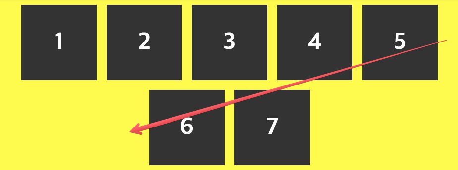
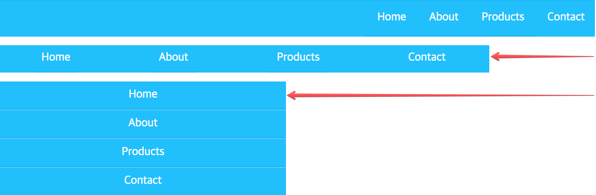

###### CSS Layout

[← Back](../README.md)

# CSS Flexbox

## 1. CSS 레이아웃 역사

1. 레이아웃이 없던 시절
1. Table 레이아웃
1. Frame 레이아웃
1. Floating, Positioning 레이아웃
1. __Flexbox 레이아웃__
1. Grid 레이아웃

## 2. CSS Flexbox 모듈

[w3.org/TR/css-flexbox-1](https://www.w3.org/TR/css-flexbox-1/)

Flex 레이아웃을 정의하는 목적은 아이템의 폭과 높이를 모든 디스플레이 장치에서
사용할 수있는 공간을 최적으로 채우도록 변경하는 능력입니다.

Flexbox 레이아웃 알고리즘은 수직 방향으로 편향된 Block 레이아웃이나
수평 방향으로 편향된 Inline 레이아웃과는 대조적으로,
방향에 대해 독단적하지 않습니다.

Block 레이아웃 모드는 UA 변경이나 수평/수직의 전환 등에 의한 방향의 변화, 크기 조정, 확대, 축소 등에
적합한 방법을 제공하고 있지 않습니다. 반면 Flexbox 레이아웃 모드는 애플리케이션 컴포넌트 및 작고
다양한 화면 레이아웃에 적합합니다. 다른 레이아웃 모드인 Grid는 큰 화면에 적합합니다.

## 3. CSS Flexbox 구조

Flexbox에서 사용되는 구조 및 용어

용어 | 설명 | 비고
--- | --- | ---
Flex Container | Flex 컨테이너 | Flex 아이템들의 부모 역할
Flex Items | Flex 아이템 |
Main Axis | 주축, `flex-direction` 설정에 따라 변경 |
Main Start | 주축의 시작점 |
Main End | 주축의 끝점 |
Main Size | 주축의 길이(시작점 - 끝점) |
Cross Axis | 교차축, `flex-direction` 설정에 따라 변경 |
Cross Start | 교차축의 시작점 |
Cross End | 교차축의 끝점 |
Cross Size | 교차축의 길이(시작점 - 끝점) |

<br>

# Flex Container 설정


`display` 속성 값으로 `flex` 또는 `inline-flex` 설정

```css
.flex-container {
  display: flex; /* flex | inline-flex */
}
```

## Flex Direction 설정

Flexbox는 한방향으로 배치되는 레이아웃을 사용합니다. 즉, 가로 또는 세로 방향 중 한쪽으로만 레이아웃 됩니다.

__Flex 컨테이너 요소의 주축(Main Axis) 방향 설정__

<br>

- `row`: ➡︎ 방향 (`ltr`, Left to Right)
- `row-reverse`: ⬅︎ 방향  (`rtl`, Right to Left)
- `row-reverse`: ⬆︎ 방향
- `row-reverse`: ⬇︎ 방향

```css
.flex-container {
  display: flex;
  flex-direction: row; /* row | column | row-reverse | column-reverse */
}
```

## Flex Wrap 설정

기본적으로 Flex Items는 모두 한 줄에 배치됩니다. 이 속성을 변경하여 필요에 따라 Item을 래핑 할 수 있습니다.

__Flex 컨테이너 내부 아이템 래핑(Wrapping) 설정__

<br>

- `nowrap`: 래핑하지 않음
- `wrap`: 래핑
- `wrap-reverse`: 래핑(direction 순서는 그대로 상/하 방향만 반대)

```css
.flex-container {
  display: flex;
  flex-direction: row;
  flex-wrap: nowrap; /* nowrap | wrap | wrap-reverse */
}
```

## Flex Flow 설정

__Direction, Wrap 설정을 동시에 설정 (속기형 속성)__

```
flex-flow: <flex-direction> <flex-wrap>;
```

```css
.flex-container {
  display: flex;
  flex-flow: row-reverse wrap;
}
```

## Flex Alignment 설정

### A. justify-content

주축 기준으로 아이템을 정렬합니다.

__Flex 주축(Main Axis) 기준으로 정렬__

- `flex-start` 주축의 시작점 기준 아이템 배치
- `flex-end` 주축의 끝점 기준 아이템 배치
- `center` 주축의 가운데 기준 아이템 배치
- `space-between` 주축의 시작/끝점 가장자리 공백 없이 아이템 사이 균등 배치
- `space-around`: 아이템 사이 균등 배치 (시각적으로 공백 크기 다름)
- `space-evenly`: 아이템 사이 균등 배치 (시각적으로 공백 크기 동일)

<br>

```css
.flex-container {
  display: flex;
  justify-content: flex-start; /* flex-start | flex-end | center | space-between | space-around | space-evenly */
}
```

### B. align-items

교차축 기준으로 아이템을 정렬합니다. 주축 정렬(`justify-content`) 방향의 반대.

__Flex 교차축(Cross Axis) 기준으로 정렬__

- `flex-start` 교차축 시작점에 아이템 정렬
- `flex-end` 교차축 끝점에 아이템 정렬
- `center` 교차축 가운데 아이템 정렬
- `stretch` 교차축 길이에 아이템 채움
- `baseline` 베이스라인(기준선)에 맞춰 아이템 정렬

<br>

```css
.flex-container {
  display: flex;
  align-items: flex-start; /* flex-start | flex-end | center | baseline | stretch */
}
```

### C. align-content

교차축 아이템 배치 후 여유 공간이 있을 경우, Flex 컨테이너 라인(선)을 정렬.<br>
주축 안에서 개별 아이템을 정렬(`justify-content`)하는 방법과 비슷.

※ 아이템이 한 줄로 배치된 경우 효과가 없음.


__Flex 컨테이너 선 기준으로 라인(묶음) 정렬__

- `flex-start` 컨테이너 시작 부분에 라인(묶음) 정렬
- `flex-end` 컨테이너 끝 부분에 라인(묶음) 정렬
- `center` 컨테이너 가운데 라인(묶음) 배치
- `stretch` 컨테이너 시작/끝 부분에 라인(묶음) 채움
- `space-between` 컨테이너 시작/끝 부분에 공백 없이 라인(묶음) 균등 정렬
- `space-around` 라인(묶음) 균등 정렬

<br>

```css
.flex-container {
  display: flex;
  align-content: flex-start; /* flex-start | flex-end | center | space-between | space-around | stretch */
}
```

# Flex Items 설정

컨테이너에 포함된 자식 아이템을 말합니다.

※ `float`, `clear`, `vertical-align` 속성은 Flex 아이템에 적용되지 않습니다.


## Order 설정

Flex 아이템 순서를 정수 값으로 설정

※ 마크업 순서가 변경되는 것은 아님. 시각적으로만 순서가 변경됨.

```
order: <정수>; /* 기본 값: 0 */
```

```css
.flex-item {
  order: -1; /* 0 보다 먼저 배치됨 */
  order: 4;  /* 0 보다 나중에 배치됨 */
}
```

## Grow 설정

Flex 아이템의 크기를 키울 수 있도록 설정합니다.
<br>모든 아이템에 `flex-grow: 1` 설정하면 컨테이너 내부 공간을 균등 분할합니다.

※ 음수(`-`) 값은 적용되지 않습니다.


```
flex-grow: <number>; /* 기본 값: 0 */
```

```css
.flex-item {
  flex-grow: 1;
}
```

## Shrink 설정

Flex 아이템의 크기를 줄일 수 있도록 설정합니다. (`flex-grow` 속성의 반대)

※ 음수(`-`) 값은 적용되지 않습니다.

```
flex-shrink: <number>; /* 기본 값: 1 */
```

```css
.flex-item {
  flex-shrink: 0;
}
```

## Basis 설정

Flex 아이템의 크기를 기본 설장합니다.<br>
키워드 `auto`, 길이(예: 20%, 120px, 40rem 등) 값을 사용할 수 있습니다.

`auto` 키워드는 "자신의 width 또는 height 속성" 값을 사용합니다.

<br>

> __`flex-basis: 0`__<br>
> 값을 `0`으로 설정하면 아이템 간 분산(길이 나눔)이 이루어집니다.<br>

> __`flex-basis: auto`__<br>
> 값이 `auto`일 경우, 아이템 내부 공간을 분산합니다. (`flex-grow` 값이 `0`이 아닐 경우)<br>
>
> _아이템 길이 분산 (All Space Distributed)_<br>
> <br>
> _아이템 내부 공간 분산 (Extra Space Distributed)_

<br>

```
flex-basis: <length> | auto; /* 기본 값: auto */
```

```css
.flex-item {
  flex-basis: 25%;
}
```

## Flex 설정

Grow, Shrink, Basis 속성 값을 한 번에 설정합니다. (속기형 속성)<br>
2(`flex-shrink`), 3(`flex-basis`)번째 속성은 옵션입니다.

※ 개별 속성 대신 속기형 속성을 사용하는 것이 좋습니다.

```
flex: none | [ <'flex-grow'> <'flex-shrink'>? || <'flex-basis'> ] /* 기본 값: 0 1 auto */
```

```css
.flex-item {
  flex: 1 44rem; /* 1 1 44rem */
}
```

## Align Self 설정

컨테이너에 의해 설정된 기본 `align-items` 값을 아이템마다 덮어쓸 수 있습니다.


```
align-self: auto; /* auto | flex-start | flex-end | center | baseline | stretch */
```

```css
.flex-item {
  align-self: flex-end;
}
```

<br>
<br>

# Flexbox 레이아웃 DEMO

1) Flex 아이템 균등 분산(상하좌우 방향) 레이아웃


<br>
<br>

__HTML__

```html
<div class="flex-container">
  <div class="flex-item"></div>
  <div class="flex-item"></div>
  <div class="flex-item"></div>
</div>
```

__CSS__

```css
.flex-container {
  display: flex;
  height: 140px;
  background: #ff0;
}

.flex-item {
  flex: 0 1 100px;
  height: 60px;
  margin: auto;
  background: #333;
}
```

<br>

__2) 아이템 주축 가운데 배치 & 래핑__



<br>
<br>

__HTML__

```html
<ul class="flex-container reset-list">
  <li class="flex-item straight-center">1</li>
  <li class="flex-item straight-center">2</li>
  <li class="flex-item straight-center">3</li>
  <li class="flex-item straight-center">4</li>
  <li class="flex-item straight-center">5</li>
  <li class="flex-item straight-center">6</li>
</ul>
```

__CSS__

```css
.flex-container {
  display: flex;
  flex-flow: row wrap;
  justify-content: space-around;
}

.flex-item {
  width: 200px;
  height: 150px;
  margin-top: 10px;
  padding: 5px;
  font-weight: bold;
  font-size: 3rem;
  background: #ff6348;
  color: white;
}

.reset-list {
  margin-top: 0;
  margin-bottom: 0;
  padding-left: 0;
  list-style: none;
}

.straight-center {
  display: flex;
  justify-content: center;
  align-items: center;
}
```

<br>

__3) 반응형 웹 내비게이션__



<br>
<br>


__HTML__

```html
<ul class="navigation">
  <li><a class="navigation__link" href="#">Home</a></li>
  <li><a class="navigation__link" href="#">About</a></li>
  <li><a class="navigation__link" href="#">Products</a></li>
  <li><a class="navigation__link" href="#">Contact</a></li>
</ul>
```

__CSS__

```css
/* Mobile First */
.navigation {
  display: flex;
  flex-flow: column wrap;
  justify-content: flex-end;
  background: #ff0;
}

.navigation__link {
  display: block;
  border-top: 1px solid rgba(255,255,255,0.3);
  border-bottom: 1px solid rgba(0,0,0,0.1);
  padding: 10px;
  text-align: center;
  color: #333;
}

.navigation li:last-child .navigation__link {
  border-bottom: none;
}

.navigation__link:hover,
.navigation__link:focus {
  background: #00b7f5;
}

.reset-link {
  text-decoration: none;
}

/* Tablet */
@media screen and (min-width: 600px) {
  .navigation {
    flex-flow: row wrap;
    justify-content: space-around;
  }
}

/* Desktop */
@media screen and (min-width: 800px) {
  .navigation {
    justify-content: flex-end;
  }
  .navigation__link {
    padding: 1em;
  }
}
```

4) 반응형 웹 레이아웃

[데모 보기, codepen.io](https://codepen.io/yamoo9/pen/dZWYam)

