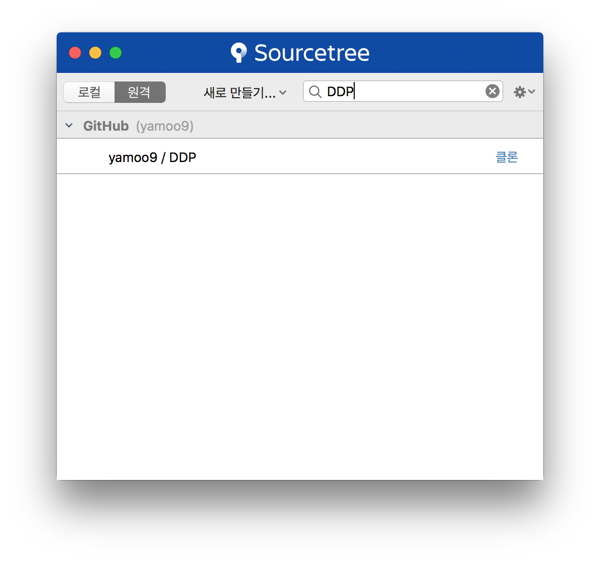
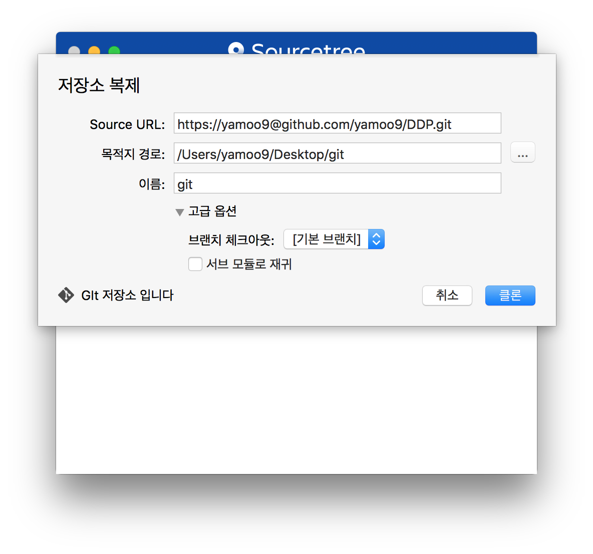
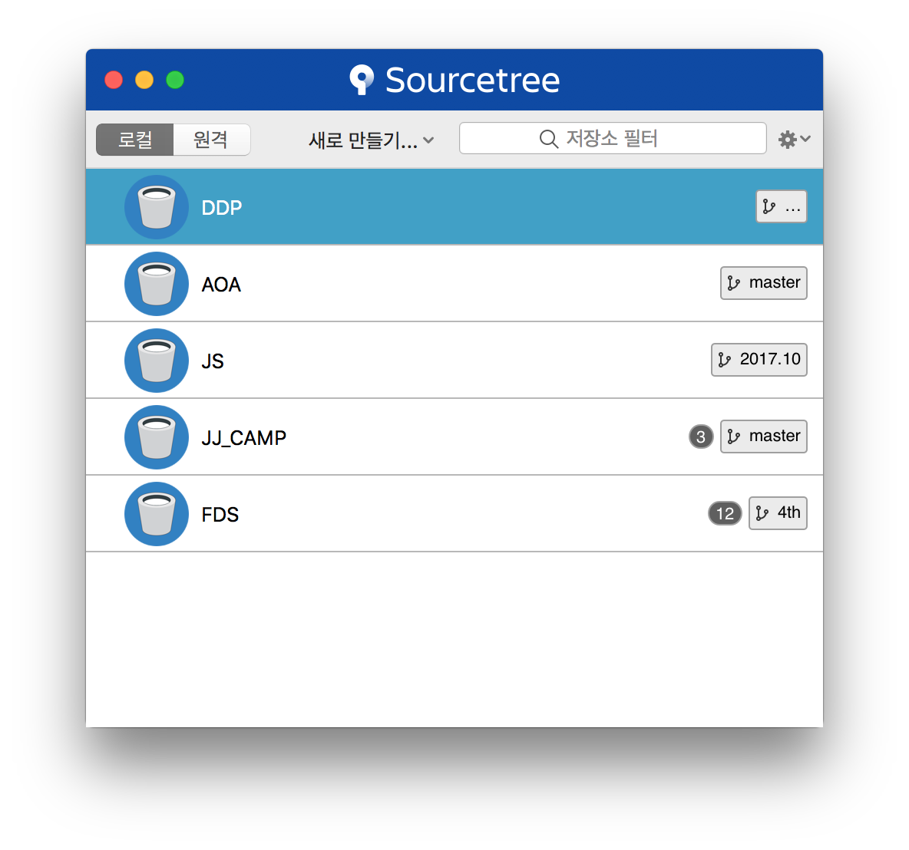
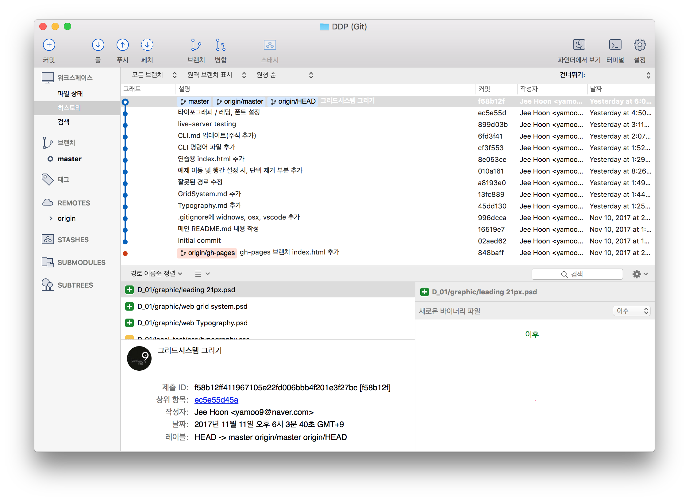
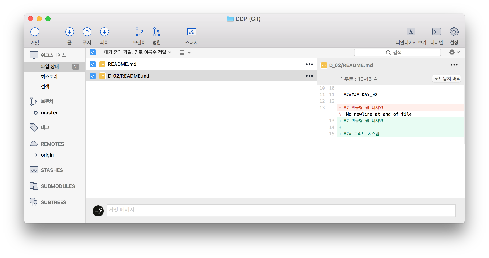
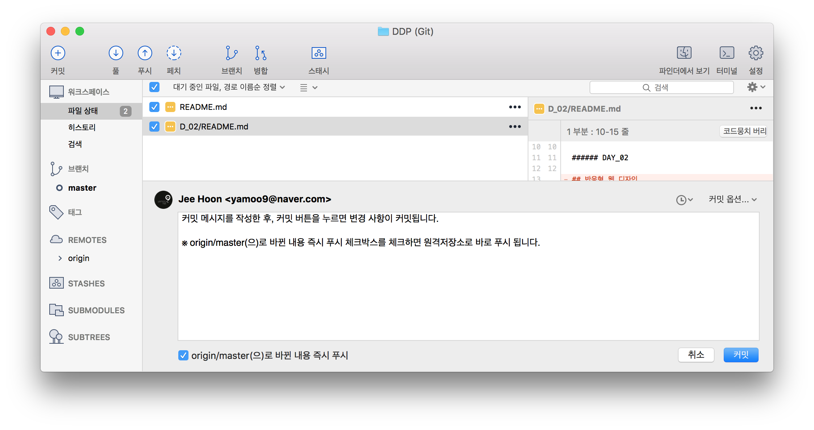
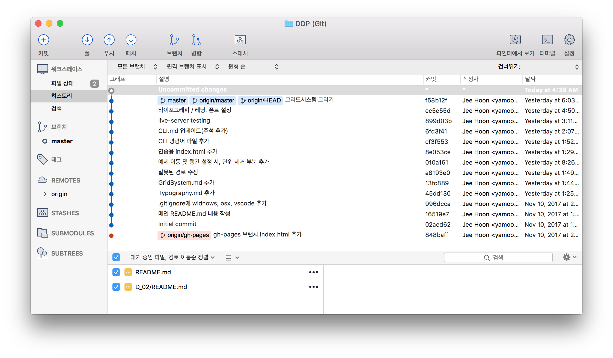
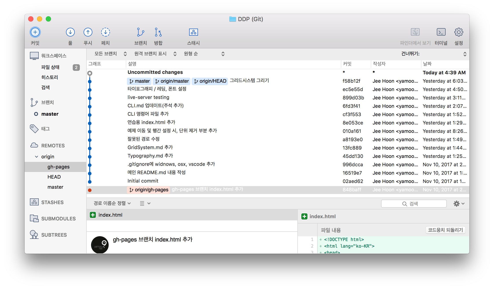
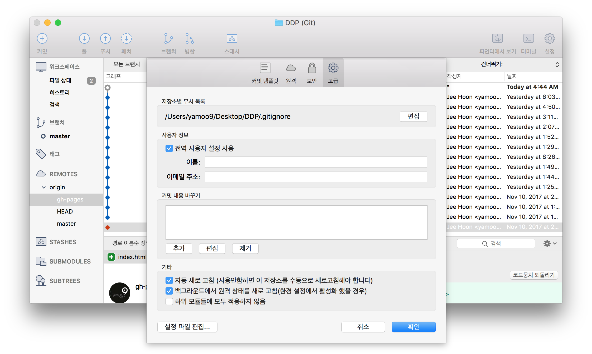

### 내비게이션

- [Home](../README.md) 
- [D_01](../D_01/README.md) 
- D_02 
- [D_03](../D_03/README.md) 
- [D_04](../D_04/README.md) 

---

###### DAY_02

## Git 관리 GUI 도구

직관적인 GUI 도구 인터페이스를 사용해 Git을 관리 해봅니다.

### SourceTree

GUI 도구로 <strong>소스트리</strong>를 예시로 사용법을 설명합니다.

 

1) SourceTree 구동 시 모달 윈도우가 화면에 띄워집니다. 보이지 않는다면, <strong>메뉴 > `"새로 만들기"`</strong> 를 선택합니다. 
로컬/원격 탭을 클릭하면 내 컴퓨터 저장소/GitHub 원격 저장소 관리 항목을 볼 수 있습니다. 
원격 항목을 검색하면 필터되어 화면에 표시됩니다.

 

2) 필터링된 원격저장소를 로컬(내 컴퓨터)로 복제합니다. 목적지 경로 및 고급 옵션 > 브랜치를 설정한 후 클론 버튼을 누릅니다.

 

3) 로컬 드라이브로 복제된 원격 저장소의 데이터가 인터페이스에 표시됩니다.

 

4) 복제된 저장소 항목을 마우스로 더블 클릭하면 Git 관리 인터페이스 창이 뜹니다. 
왼쪽 사이드바를 보면 "파일 상태", "히스토리" 등 워크스페이스 항목에서 기본 관리를 합니다.

 

5) 관리 중인 로컬 저장소에 변경 사항이 발생하면 "파일 상태"에 변경된 파일 개수가 표시되고, 
표시된 파일을 클릭하면 오른쪽에 변경 사항을 확인할 수 있습니다.

 

6) 변경사항을 커밋할 경우, 하단 커밋 메시지를 마우스로 클릭한 후 메시지를 작성합니다. 
"origin/master(으)로 바뀐 내용 즉시 푸시" 체크박스를 체크하면 커밋 뿐만 아니라 원격 저장소로 바로 푸시됩니다.

 

<!--   -->

7) 왼쪽 사이드바에서 브랜치, 원격(REMOTES) 브랜치 등을 클릭하면 개별적으로 관리할 수 있습니다.

 

8) 설정 > "`고급`" 항목을 통해 .gitignore 편집 및 사용자 정보를 입력할 수 있습니다.

 

 

## 반응형 웹 디자인

### 그리드 시스템 (Grid System)

- [CSS Grid System](./CSS/CSS__Grid-System.md)

### Sass 프리프로세서 (Pre Processor)

- [Sass](./Sass/Sass.md)
- [Sass Guideline](./Sass/Sass__Guideline.md)
- [Bourbon, Sass Library](./Sass/Sass__Bourbon.md)
- [Susy, Sass Library](./Sass/Sass__Susy.md)
- [Sass Doc](./Sass/Sass__Doc.md)

### CSS 플렉스박스 (Flexbox)

- [CSS Flexbox Module](./CSS/CSS__Flexbox.md)

### CSS 그리드 (Grid)

- [CSS Grid Module](./CSS/CSS__Grid.md)