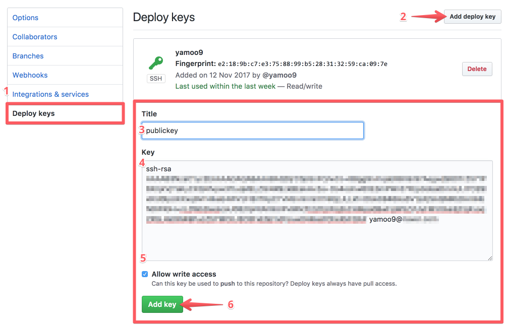
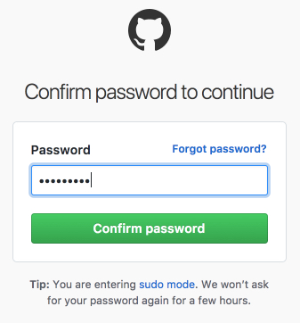
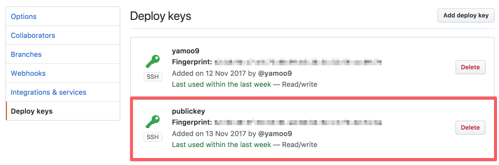

###### Git Push Error

# Permission denied (publickey).

### 증상

로컬 저장소 변경 사항을 커밋한 후, GitHub 저장소에 푸시할 때 권한이 없다며 오류 발생.

```sh
$ git push origin master

# Agent admitted failure to sign using the key.
# Permission denied (publickey).
# fatal: The remote end hung up unexpectedly
```

### 원인

사용자 로컬 컴퓨터에 저장된 ssh publickey(`id_rsa.pub`)가
GitHub 저장소에 등록되지 않아 접근 권한이 없어 발생.

### 해결책

ssh publickey(`id_rsa.pub`)가 로컬 컴퓨터에 저장되어 있는지 확인.

```sh
$ cat ~/.ssh/id_rsa.pub
```

#### 1. ssh publickey가 없는 경우

파일 또는 디렉토리가 없다는 메시지가 출력될 경우, ssh publickey를 생성해야 한다.

```sh
$ cat ~/.ssh/id_rsa.pub

# cat: /Users/yamoo9/.ssh/id_rsa.pub: No such file or directory
```

ssh-keygen 생성

```sh
$ ssh-keygen -t rsa -C "사용자@이메일.주소"

# Generating public/private rsa key pair.
# Enter file in which to save the key (/Users/yamoo9/.ssh/id_rsa):
# /Users/yamoo9/.ssh/id_rsa already exists.
# Overwrite (y/n)? y
# Enter passphrase (empty for no passphrase):
# Enter same passphrase again:
# Your identification has been saved in /Users/yamoo9/.ssh/id_rsa.
# Your public key has been saved in /Users/yamoo9/.ssh/id_rsa.pub.
# The key fingerprint is:
# SHA256:XXXXXXXXXXXX/XXXXXXXXXXXXXXXXXXXXXXXXXXXXXX yamoo9@XXX.XXX
# The key's randomart image is:
# +---[RSA 2048]----+
# |             +=o.|
# |            .*ooo|
# |          o + = +|
# |         o o.+ .o|
# |    o + S o.o.oo |
# |   o X   o.B o+  |
# |    * E . o.=.   |
# |   . + +...  o   |
# |    . ..+o..o..  |
# +----[SHA256]-----+
```

생성된 ssh publickey `id_rsa`는 `/Users/사용자계정/.ssh/` 위치에 생성된다.

`id_rsa` 파일은 보안상 공개되서는 안되는 키이고, `id_rsa.pub` 파일의 키 값이 필요하다.<br>
명령 도구 창에 출력된 `id_rsa.pub` 키 값을 복사한다.

```sh
$ cat ~/.ssh/id_rsa.pub

# ssh-rsa XXXXXXXXXXXXXXXXXXXXXXXXXXXXXXXXXXXXXXXX/XXXXXXXXXXXXXXXXXXXXXXXXXXXXXXXXXXXXXXXXXXXXXXXXXXXXXXXXXXXXXXXXXXXXX
# XXXXXXXXXXXXXXXXXXXXXXXXXXXXXXXXXXXXXXXXXXXXXXXXXXXXXXXXXXXXXXXXXXXXXXXXXXXXXXXXXXXXXXXXXXXXXXXXXXXXXXXXXXXXXXXXXXXXXX
# XXXXXXXXXXXXXXXXXXXXXXXXXXXXXXXXXXXXXXXXXXXXXXXXXXXXXXXXXXXXXXXXXXXXXXXXXXXXXXXXXXXXXXXXXXXXXXXXXXXXXXXXXXXXXXXXXXXXXX
# XXXXXX/XXXXXXXXXXXX yamoo9@XXX.XXX
```

#### 2. ssh publickey가 있는 경우

ssh publickey 값을 복사한다.

```sh
$ cat ~/.ssh/id_rsa.pub

# ssh-rsa XXXXXXXXXXXXXXXXXXXXXXXXXXXXXXXXXXXXXXXX/XXXXXXXXXXXXXXXXXXXXXXXXXXXXXXXXXXXXXXXXXXXXXXXXXXXXXXXXXXXXXXXXXXXXX
```

#### 3. GitHub 저장소에 ssh publickey 등록

다음 과정을 순차적으로 진행하여 ssh publickey 키를 등록한다.

<br>

1) GitHub 저장소 설정(Settings) 메뉴를 클릭한다.


<br>
<br>

2) Deploy Keys 메뉴를 클릭, 이어서 Add deploy key 버튼을 클릭한다.<br>
Title 및 Key 입력 필드가 화면에 표시되면 적절한 이름의 Title을 입력하고,<br>
복사한 `id_rsa.pub` 키를 Key 입력 필드에 붙여 넣는다.<br><br>
Allow write access 체크 후, Add key 버튼을 눌러 등록한다.



<br>
<br>

3) 등록을 마무리 하기 위해 GitHub 계정 패스워드를 입력 후,<br>
Confirm password 버튼을 누른다.



<br>
<br>

4) ssh publickey가 잘 등록되었는지 확인한다.<br>
__successfully authenticated__ 메시지가 출력되면 등록에 성공한 것이다.

```sh
$ ssh -T git@github.com

# Hi yamoo9/XXXX! You've successfully authenticated, but GitHub does not provide shell access.
```

<br>

5) GitHub 저장소 Deploy Keys 항목에 SSH 키가 녹색으로 표시된다.



<br>
<br>
<br>

### 오류 해결

GtHub에 푸시하는데 더 이상 권한 오류가 발생하지 않는다.

```sh
$ git push origin master

# Counting objects: 9, done.
# Delta compression using up to 8 threads.
# Compressing objects: 100% (9/9), done.
# Writing objects: 100% (9/9), 447.67 KiB | 1.17 MiB/s, done.
# Total 9 (delta 3), reused 0 (delta 0)
# remote: Resolving deltas: 100% (3/3), completed with 2 local objects.
# To github.com:yamoo9/XXXX.git
#    XXXXXXX..XXXXXXX  master -> master
```